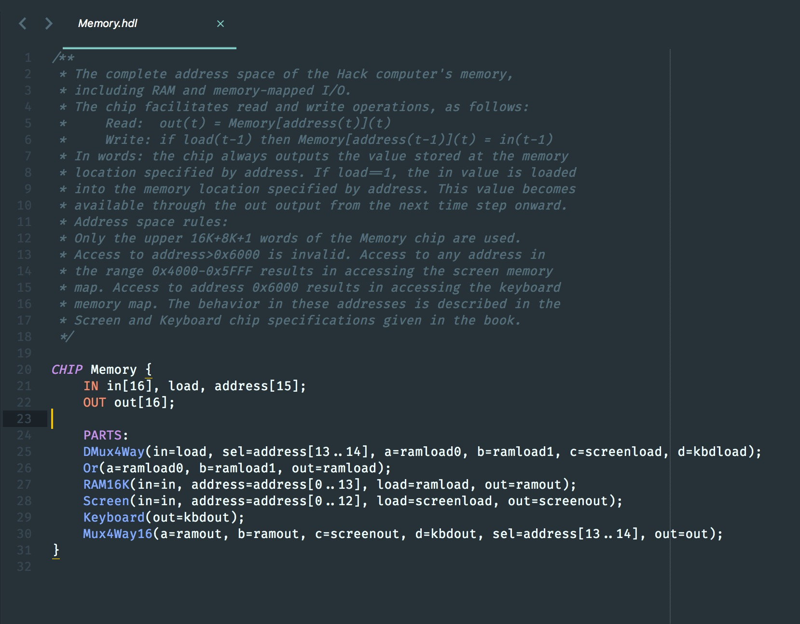
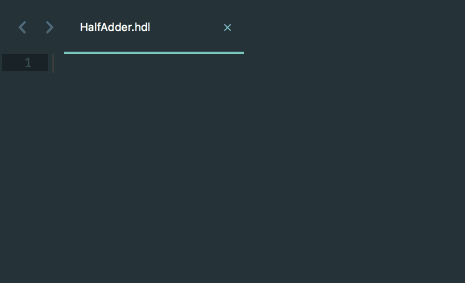

# Sublime Text HDL Support

Provides syntax highlighting for the hardware description language defined in  "[The Elements of a Modern Computing System](www.nand2tetris.org)".

## Installation

### Using Package Control

- [Install Package Control](//packagecontrol.io/installation) if you haven't already
- Open the Command Palette in Sublime Text(`Cmd/Ctrl+Shift+ P`)
- Select 'Package Control: Install Package'
- Search for and select 'HDL Syntax Highlighting'

### Manual installation

- Clone this repository(`git clone https://github.com/shreyasminocha/Sublime-HDL`)
- Move the cloned repository to your Sublime Text [user packages folder](//docs.sublimetext.info/en/latest/basic_concepts.html#the-user-package)
- Restart Sublime Text if required

## Features

- Syntax highlighting
- Snippets
    - A template for `CHIP`.
    - Statements for using built-in chips.

## License

Licensed under the [MIT License](https://shreyas.mit-license.org/2017).

## Contributing

You're more than welcome to [add a feature](//github.com/shreyasminocha/Sublime-HDL/pulls), [report a bug](//github.com/shreyasminocha/Sublime-HDL/issues) or [submit suggestions](//github.com/shreyasminocha/Sublime-HDL/issues).
